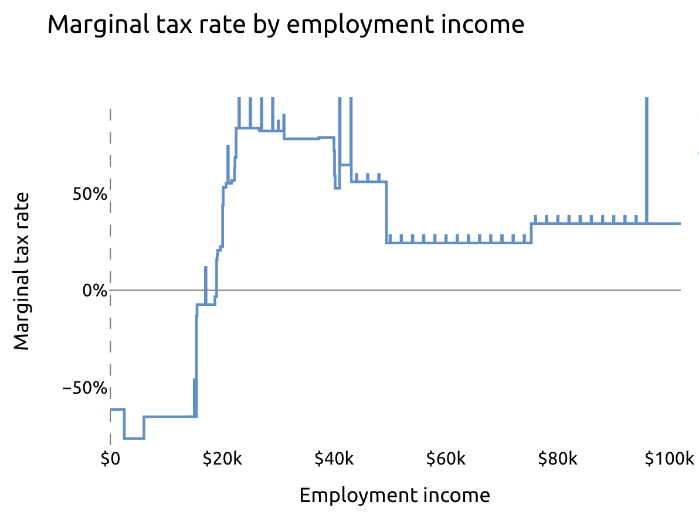
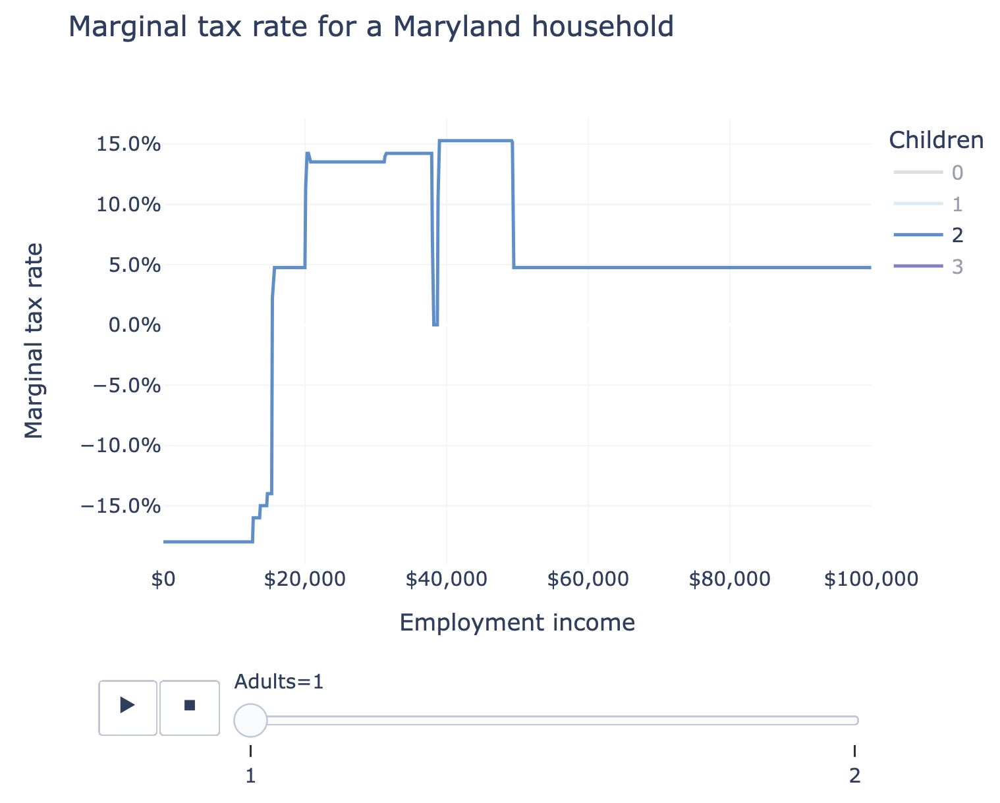
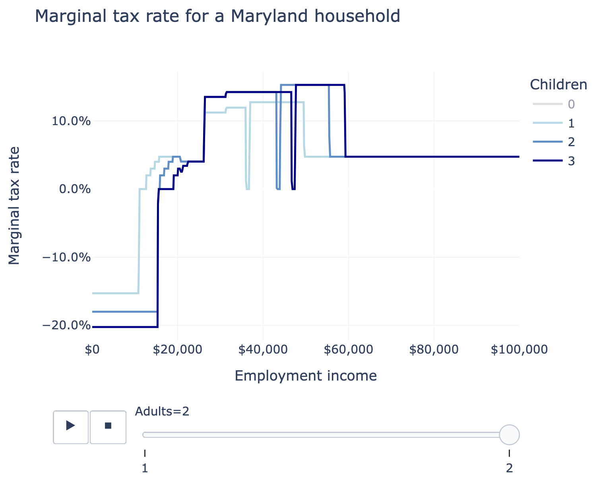

Many basic income proposals in the US have a national scope, allowing blue-sky thinking to fund a costly new program. For example, we've simulated [Andrew Yang's Freedom Dividend](https://www.ubicenter.org/distributional-analysis-of-andrew-yangs-freedom-dividend), a [UBI funded by a flat income tax](https://www.ubicenter.org/us-flat-tax), and a [national carbon dividend](https://www.ubicenter.org/us-carbon-dividend), and we're working on a "Blank Slate UBI" for the US, emulating the [UK report we published last year](https://www.ubicenter.org/uk-blank-slate-ubi).

However, recent campaigns have considered more state-level action, following the [Alaska Permanent Fund Dividend](https://pfd.alaska.gov/), [Idaho's Grocery Credit](https://tax.idaho.gov/i-1043.cfm), and the dozens of states that have enacted [tax credits for low-income families](https://www.taxcreditsforworkersandfamilies.org/state-tax-credits/). A grasp of existing tax and benefit programs in states creates 50 more canvases for fundamental policy experimentation and analysis.

In this report, rather than simulating basic income policies, we zoom in on one state: Maryland; specifically, Maryland's tax policies. We find that, just as the federal tax-benefit system levies the highest marginal tax rates on the poor, Maryland does too. Our results suggest that policymakers who wish for a more equitable incentive structure—both at the federal and state level—have opportunities for reform by relying less on means-tested tax credits.

# Maryland's tax policy

Maryland has six million residents and a [poverty rate of 10.8 percent](https://www.census.gov/content/dam/Census/library/publications/2021/demo/p60-275.pdf#page=32), slightly below the national average. It has the [highest median income of any state](https://en.wikipedia.org/wiki/List_of_U.S._states_and_territories_by_income), owing both to its relatively high GDP per capita ([15th among states](https://en.wikipedia.org/wiki/List_of_U.S._states_and_territories_by_GDP)) and low inequality ([35th among states](https://www.epi.org/multimedia/unequal-states-of-america/#/Maryland)).

Like the US and many states, Maryland's core income tax rates rise with income. The progressive structure ranges from 2 percent on income below $1,000 to 5.75 percent on income above $250,000 (single) or $300,000 (non-single).

But also like the US and many states, that core income tax is a small part of the puzzle, especially for low-income families. Here are just a few of the other provisions Maryland enacts:

* Standard deduction set at 15 percent of adjusted gross income, with upper and lower limits based on filing status
* Personal exemptions that phase out with income
* Earned Income Tax Credit that matches part of the federal program
* Child and Dependent Care Tax Credit that phases out with income
* Poverty Line Tax Credit that matches up to 5 percent of earned income
* Child Tax Credit for low-income families with children under 6 who have disabilities

Some of these programs phase in with income, and nearly all phase out with income. As a result, Maryland households with income in the phase-out region face marginal tax rates beyond the standard 2 percent to 5.75 percent: the loss of tax benefits acts as an additional marginal tax.

# Impact of Maryland's tax programs

Using [PolicyEngine](policyengine.org), a free open-source web app that computes the impact of public policy (incubated within the UBI Center), we evaluate Maryland's tax policies as they situate alongside the federal tax and benefit system.

Consider a single parent with two children, paying $1,000 per month in rent and $500 per month in childcare, and working full time at Maryland's standard minimum wage of $12.50 per hour. Their net income is $41,554 per year:[^1]

* $25,000 in earnings
* $7,934 in benefits
* $1,912 in payroll taxes
* $8,138 in net federal taxes (that is, net negative tax liability due to refundable credits)
* $2,395 in state taxes (also due to refundable credits)

Maryland supplements their income by six percent. But as they earn more, the state withdraws that assistance. Suppose the parent picks up an extra hour of work per week, adding $650 to their annual earnings. Their net income rises to $41,640—they don't even capture $100 of their extra work. Their true wage is not $12.50, but $86 / 52 hours = $1.65 per hour.

We can characterize the difference between one's nominal wage and their take-home wage as the _marginal tax rate_—the share of an extra dollar of earnings that the government takes, either through taxes or through withdrawing benefits. In this case, their marginal tax rate on the $650 of marginal wages is ($650-$86)/$650=87%. The PolicyEngine chart below details how this single parent’s marginal tax rate changes with additional income (the spikes are from programs that step down rather than phase out smoothly).

[Maryland's tax code](https://policyengine.github.io/openfisca-us//programs/states/md/tax/income/index.html) explains about one-sixth of this marginal tax rate; at $25,000 income, they face a 13.5% marginal tax rate from state taxes.

Many types of families at or near the poverty line face high marginal tax rates. For example, Maryland taxes married families with children at two to three times the top rate of 5.75%, if they earn between about $25,000 and $60,000. Maryland's true top marginal rate is 15.3%, and that's placed to stack atop federal tax and benefit marginal rates that often exceed 50%.

# Where Maryland can go from here

Maryland's enhanced Earned Income Tax Credit and Child Tax Credit will expire after the 2022 tax year, and lawmakers are already considering legislation to remake and extend these programs in 2023 and beyond. Policymakers should consider the impacts on work incentives in addition to poverty when designing their replacements and future benefit reforms.

[^1]: This analysis applies 2022 law, assuming that SNAP Covid emergency allotments have expired.
